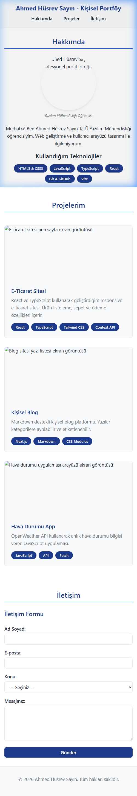
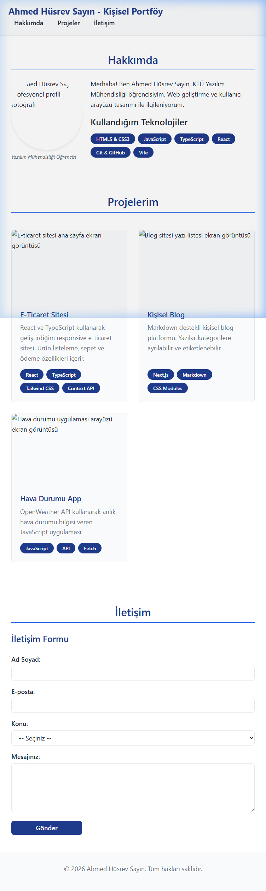
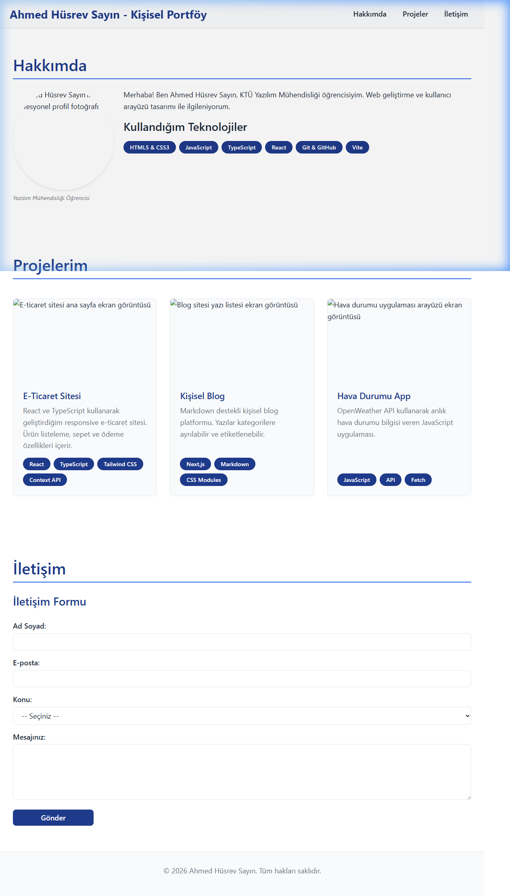

# Web LAB-3 - Modern CSS ve Responsive Layout

## 📝 Hakkında
Bu proje, Web Tasarımı ve Programlama dersi LAB-3 kapsamında modern CSS teknikleri, Flexbox/Grid layout sistemleri ve responsive tasarım üzerine geliştirilmiştir. LAB-1 ve LAB-2 kazanımları korunmuştur.

## 👨‍💻 Geliştirici
- **Ad Soyad:** Ahmed Hüsrev Sayın
- **Öğrenci No:** 225541103
- **Bölüm:** Yazılım Mühendisliği

## 🎯 LAB-3 Öğrenme Hedefleri
- ✅ Mobile-first yaklaşımla CSS yazma
- ✅ 3 breakpoint'e göre responsive tasarım
- ✅ CSS değişkenleri (design tokens)
- ✅ Fluid typography (clamp)
- ✅ Flexbox ile tek boyutlu düzenler (nav, toolbar)
- ✅ CSS Grid ile iki boyutlu düzenler (kart ızgarası)
- ✅ Responsive navigasyon
- ✅ Responsive kart düzeni

## 🛠️ Kullanılan Teknolojiler
- React 18
- TypeScript 5
- Vite 5
- Modern CSS (Flexbox, Grid)
- CSS Custom Properties
- Responsive Design (Mobile-First)

## 📱 Breakpoint Yapısı

| Cihaz | Genişlik | Proje Kartları Sütun Sayısı |
|-------|----------|-----------------------------|
| Mobil | 0–639px | 1 sütun |
| Tablet | 640–1023px | 2 sütun |
| Masaüstü | 1024px+ | 3 sütun |

## 🎨 Design Tokens

### Renk Paleti
- Primary: `#1E3A8A` (Lacivert)
- Secondary: `#2563EB` (Açık Mavi)
- Accent: `#7C3AED` (Mor)

### Spacing Skalası
- xs: 4px · sm: 8px · md: 16px · lg: 24px · xl: 32px · 2xl: 48px · 3xl: 64px

## 📦 Kurulum
```bash
npm install
```

## 🚀 Çalıştırma
```bash
npm run dev
```

## 📁 Proje Yapısı
```
web-lab-hello/
├── src/
│   ├── styles/
│   │   ├── tokens.css       # Design tokens
│   │   └── responsive.css   # 3-breakpoint responsive layout
│   ├── App.tsx              # Ana bileşen
│   ├── App.css              # CSS giriş noktası (imports)
│   └── main.tsx
├── screenshots/
│   ├── mobile.png           # 375px
│   ├── tablet.png           # 768px
│   └── desktop.png          # 1280px
├── CSS-KARARLARI.md         # Tasarım kararları dökümantasyonu
└── README.md
```

## 💡 Öne Çıkan Özellikler

### Flexbox Kullanımı
- Sticky header: logo sol, nav sağ (`space-between`)
- Mobilde nav `flex-wrap: wrap` ile satır atlıyor
- Beceri etiketleri (`skill-tags`) `flex-wrap` ile sarmalıyor

### CSS Grid Kullanımı
- Proje kartları: `repeat(auto-fit, minmax(280px, 1fr))`
- Masaüstünde açıkça `repeat(3, 1fr)` ile 3 sütun
- Kartlar `flex-direction: column` + `flex-grow: 1` ile eşit yükseklikte

### Fluid Typography
```css
h1 { font-size: clamp(2rem, 1.2rem + 3vw, 3.5rem); }
h2 { font-size: clamp(1.5rem, 1rem + 2vw, 2.5rem); }
```

## 📸 Ekran Görüntüleri

### Mobil (375px)


### Tablet (768px)


### Masaüstü (1280px)


## 📚 Kaynaklar
- [CSS Tricks - Flexbox Guide](https://css-tricks.com/snippets/css/a-guide-to-flexbox/)
- [CSS Tricks - Grid Guide](https://css-tricks.com/snippets/css/complete-guide-grid/)
- [MDN - Responsive Design](https://developer.mozilla.org/en-US/docs/Learn/CSS/CSS_layout/Responsive_Design)
- [Utopia - Fluid Typography](https://utopia.fyi/)
